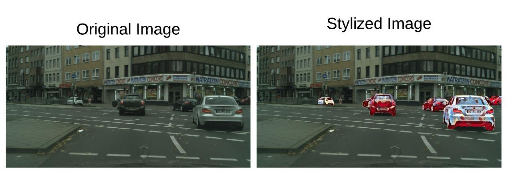

## Class-Based Styling
### Real-time Localized Style Transfer with Semantic Segmentation
##### ICCV 2019 Computer Vision for Fashion, Art and Design 
[[Paper]]()[[Video]](https://www.youtube.com/watch?v=A_SwsM7Ox5M)

### Running the code
Given an input image, our method CBS can stylize a certain object class with a specifi style. Run
the following command to achieve a result similar to the one below.

```
python main.py -i images/example.png -o images/stylized.png -s styles/mosaic.pth -c pedestrian
```


 

### Relevant work

For segmentation, we used the pretrained model in [1]
For style transfer, we used the pretrained model in [2].

In this work we combined these two pretrained models to segment different objects in a scene. But if you would like to train for segmenting new objects or new styles, you can use the training scripts in [1,2].

[1] https://github.com/Reagan1311/DABNet/
[2] https://github.com/pytorch/examples/tree/master/fast_neural_style


## Citation 
If you find the code useful for your research, please cite:

```
@misc{kurzman2019classbased,
    title={Class-Based Styling: Real-time Localized Style Transfer with Semantic Segmentation},
    author={Lironne Kurzman and David Vazquez and Issam Laradji},
    year={2019},
    eprint={1908.11525},
    archivePrefix={arXiv},
    primaryClass={cs.CV}
}
```
